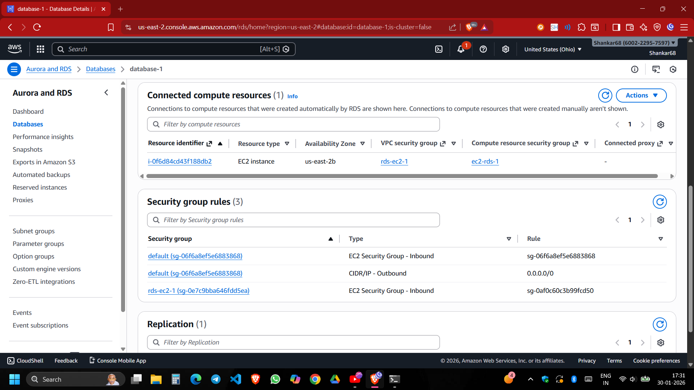
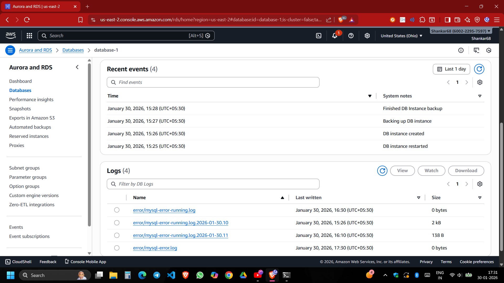
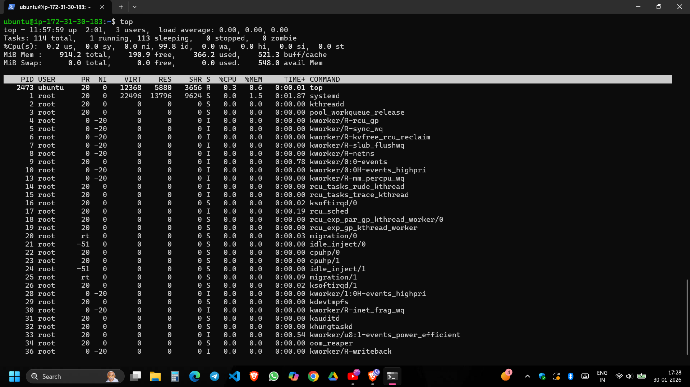

# Connecting AWS EC2 to RDS MySQL Database

This project demonstrates the setup and verification of a secure connection between an Amazon EC2 instance and an Amazon RDS MySQL database.

## Project Overview

The goal is to establish a connection where an application running on an EC2 instance can communicate with a managed RDS MySQL database. This involves configuring security groups, setting up the RDS instance, and verifying the connection via the command line.

## Architecture & Setup Process

### 1. RDS Configuration & Connectivity
The RDS instance (`database-1`) is configured with specific connectivity settings. The endpoint and port information are crucial for establishing a connection.


### 2. Establishing the Connection
We set up a direct connection between the EC2 instance and the RDS database. AWS handles the security group rules to allow traffic on the database port (default 3306).

**Setup Confirmation:**


**Verified Resources:**
Once connected, the EC2 instance appears under the "Connected compute resources" section in the RDS console.


### 3. Monitoring & Utilities
AWS provides built-in monitoring tools to track the health and performance of the database.

**CloudWatch Metrics:**
CPU, storage, and connection metrics can be monitored directly from the console.


**Logs & Events:**
Recent events (like backups or restarts) and database logs are available for troubleshooting.


## Verification Steps

### 1. EC2 Instance Status
First, ensure the EC2 instance is healthy and running. We can check the system resources using the `top` command.


### 2. MySQL Connection Test
The final verification involves SSH-ing into the EC2 instance and using the `mysql` client to connect to the RDS endpoint.

**Command:**
```bash
mysql -h <RDS_ENDPOINT> -P 3306 -u <USERNAME> -p
```

**Success Output:**
Connecting successfully leads to the MySQL shell, where you can run commands like `show databases;`.

